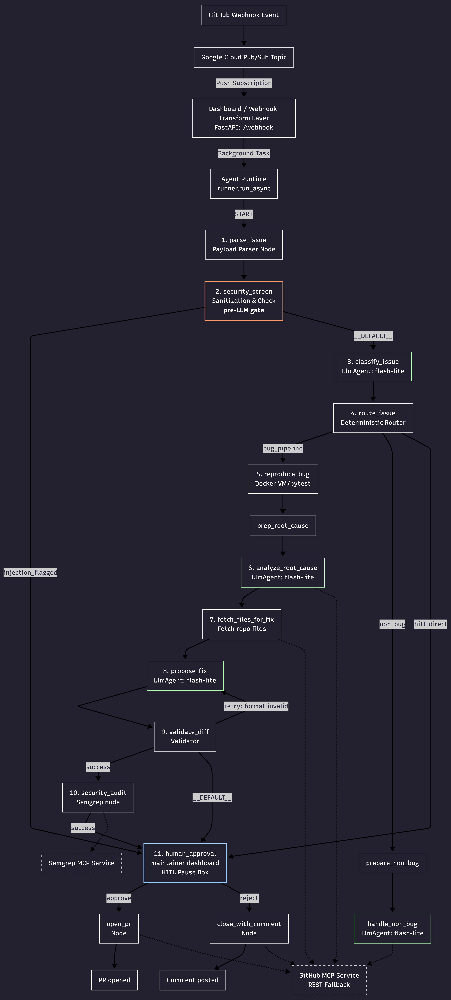

# AutoPatch

AI agent that autonomously patches GitHub issues and opens PRs.

## Problem

Manual triaging, reproduction, patching, and security auditing of software bugs is a slow, tedious, and error-prone process. Maintainers are often overwhelmed by incoming issue backlogs, while critical security reports (like prompt injections or exploits) risk exposing repositories if not isolated and screened immediately.

## Solution

**AutoPatch** is an autonomous, multi-agent AI system built using the Google ADK (Agent Development Kit). It automatically listens to GitHub webhooks, parses and sanitizes inputs, triages issues, reproduces bugs in isolated Docker sandboxes, suggests unified diffs, runs static security analysis, and prompts human maintainers for approval via a dashboard before opening PRs.

## Track

Agents for Business

## Architecture

AutoPatch operates on a stateful, event-driven graph powered by the Google ADK `Workflow` runtime. Webhook requests are normalized and transformed before entering the main execution chain.



### Webhook Transform & Runtime Entry Path
1. **GitHub Webhook Event**: Triggered by repository activity.
2. **Google Cloud Pub/Sub Topic**: Receives the payload (since a push subscription cannot hit the `:query` endpoint directly).
3. **Dashboard / Webhook Transform Layer (`/webhook` FastAPI endpoint)**: Normalizes, base64-decodes, and offloads the Pub/Sub wrapper payload to a background task.
4. **Agent Runtime**: Starts the ADK app workflow via `runner.run_async()`.

---

## Key Components

### Workflow Nodes
Below is the list of active workflow nodes extracted from [autopatch/agent.py](autopatch/agent.py):

| # | Node Name | Node Type | Model / Description |
|---|---|---|---|
| 1 | `parse_issue` | `@node` | Payload parser extracting fields from issue/webhook data. |
| 2 | `security_screen` | `@node` | **Pre-LLM Gate** detecting prompt injections and scrubbing secrets. Routes directly to HITL if injection flagged. |
| 3 | `classify_issue` | `LlmAgent` | Triages issue category (bug, spam, docs, etc.) using `gemini-2.5-flash-lite`. |
| 4 | `route_issue` | `@node` | Deterministic router based on classification & severity. |
| 5 | `reproduce_bug` | `@node` | Docker VM sandbox execution running reproduction tests (`pytest`). |
| 6 | `prepare_root_cause_input` | `@node` | Pre-processes reproduction state and traceback before root cause diagnosis. |
| 7 | `analyze_root_cause` | `LlmAgent` | Diagnoses tracebacks and locates allowed target files using `gemini-2.5-flash-lite`. |
| 8 | `fetch_files_for_fix` | `@node` | Helper node fetching code files via GitHub REST API / MCP. |
| 9 | `propose_fix` | `LlmAgent` | Proposes code changes as a unified diff using `gemini-2.5-flash-lite`. |
| 10 | `validate_diff` | `@node` | Asserts diff conformity and manages retry loop if invalid. |
| 11 | `security_audit` | `@node` | Runs post-patch Semgrep static scans of proposed diffs. |
| 12 | `human_approval` | `@node` | **HITL Pause Box** (Maintainer Dashboard) requesting manual merge/reject. |
| 13 | `open_pr` | `@node` | Commits changes and opens a GitHub Pull Request via MCP or REST fallback. |
| 14 | `close_with_comment` | `@node` | Closes issues with a rejection explanation comment via MCP or REST fallback. |
| 15 | `prepare_non_bug_input` | `@node` | Transforms triage results to prepare label and comment payloads. |
| 16 | `handle_non_bug` | `LlmAgent` | Auto-labels and comments on non-bug issues using `gemini-2.5-flash-lite` and MCP tools. |

---

## Course Concepts Demonstrated

| Course Concept | Where (Relative File Paths) | Implementation details |
| :--- | :--- | :--- |
| **Agent / Multi-agent system (ADK)** | [autopatch/agent.py](autopatch/agent.py) | Implemented using the ADK `Workflow` runtime coordinating the core LlmAgents and execution nodes. |
| **MCP Server** | [autopatch/agent.py](autopatch/agent.py) | Uses `McpServer("github")` and `McpServer("semgrep")` for external API and tool interactions. |
| **Antigravity / Agents CLI** | [pyproject.toml](pyproject.toml), [Makefile](Makefile), [agents-cli-manifest.yaml](agents-cli-manifest.yaml) | CLI targets (`playground`, `eval generate`, `eval grade`) facilitate interactive testing and grading. |
| **Security features** | [autopatch/agent.py](autopatch/agent.py) (see `security_screen` and `security_audit`) | Employs a pre-LLM gate for injection/secret scrubbing and a Semgrep audit node for scanning generated patches. |
| **Deployability** | [autopatch/agent_runtime_app.py](autopatch/agent_runtime_app.py), [autopatch/fast_api_app.py](autopatch/fast_api_app.py), [deployment/terraform/](deployment/terraform/) | Packaged as a Vertex AI Reasoning Engine and deployed with FastAPI integration for Pub/Sub push webhooks. |
| **Agent Skills** | [.agents/skills/diagram-vs-code-skill/](.agents/skills/diagram-vs-code-skill/), [.agents/skills/fix-proposal-skill/](.agents/skills/fix-proposal-skill/), [.agents/skills/issue-classifier-skill/](.agents/skills/issue-classifier-skill/), [.agents/skills/root-cause-analysis-skill/](.agents/skills/root-cause-analysis-skill/) | Standardized agent behaviors loaded dynamically from skills directories containing prompt logic and metadata. |

---

## Setup Instructions

Since this project runs on Windows, use **PowerShell** for setup and administration commands:

### 1. Clone the Repository
```powershell
git clone https://github.com/Rihito2106/autopatch.git
cd autopatch
```

### 2. Configure Environment Variables
Copy `.env.example` to `.env` and fill in the required keys (`GITHUB_TOKEN`, `GEMINI_API_KEY`, etc.):
```powershell
Copy-Item .env.example .env
# Edit the variables inside .env
notepad .env
```

### 3. Install CLI & Dependencies
Run the installation targets to set up the CLI tools and dependencies:
```powershell
# Install google-agents-cli and workspace packages
make install
```

### 4. Run Interactive Local Playground
To interactively test issues and observe the graph transitions locally:
```powershell
make playground
```

### 5. Run Evaluations
Generate and grade test traces against the evaluation suite dataset:
```powershell
make eval
```

### 6. Deploy to Development
Deploy the Agent Runtime to Google Cloud:
```powershell
make deploy
```

---

## Live Demo

The dashboard requires no login — Cloud Run is configured for unauthenticated invocations.

AutoPatch is deployed on Google Cloud Platform:
- **Agent Runtime Resource Path**: `projects/1054008692626/locations/us-west1/reasoningEngines/1559133876465434624`
- **Cloud Run Dashboard URL**: `https://autopatch-dashboard-1054008692626.us-west1.run.app`

Webhooks are forwarded via a Pub/Sub push subscription directly to the Cloud Run transform endpoint to orchestrate reasoning engines automatically.

---

## Known Limitations

1. **Semgrep MCP Fallback**: The Semgrep MCP service falls back to regex-based scanning on both Windows and Agent Runtime, as there is no native Semgrep binary available in either environment.
2. **reproduce_bug Docker Sandbox**: The Docker pytest sandbox does not run on the Agent Runtime (due to lack of Docker-in-Docker support). When deployed, the pipeline falls back to static analysis via the GitHub MCP.
3. **Cosmetic Dashboard Bug**: Clicking the "Approve" button on the maintainer dashboard occasionally throws a harmless browser alert, which has no effect on the pipeline correctness or the PR creation.
