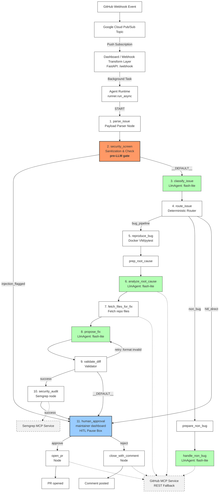

## AutoPatch Graph Workflow



### Text Fallback
```

                                  ┌──────────────────────────────┐
                                  │    GitHub Webhook Event      │
                                  └──────────────┬───────────────┘
                                                 │
                                                 ▼
                                  ┌──────────────────────────────┐
                                  │   Google Cloud Pub/Sub Topic │
                                  └──────────────┬───────────────┘
                                                 │  Push Subscription
                                                 ▼
                                  ┌──────────────────────────────┐
                                  │   Dashboard / Webhook        │
                                  │     Transform Layer          │
                                  │   (FastAPI: /webhook)        │
                                  └──────────────┬───────────────┘
                                                 │  Background Task
                                                 ▼
                                  ┌──────────────────────────────┐
                                  │        Agent Runtime         │
                                  │   (runner.run_async)         │
                                  └──────────────┬───────────────┘
                                                 │  START
                                                 ▼
                                  ┌──────────────────────────────┐
                                  │ 1. parse_issue               │
                                  │    (Payload Parser Node)     │
                                  └──────────────┬───────────────┘
                                                 │
                                                 ▼
  ┌──────────────────────────┐    ┌──────────────────────────────┐
  │      pre-LLM gate        │◀───│ 2. security_screen           │
  │ • Redacts injections     │    │    (Sanitization & Check)    │
  │ • Bypasses LLMs directly │    └──────────────┬───────────────┘
  └──────────────────────────┘                   │
                                                 ├────────────────────────────┐
                                   (__DEFAULT__) │                            │ (injection_flagged)
                                                 ▼                            │
                                  ┌──────────────────────────────┐            │
                                  │ 3. classify_issue            │            │
                                  │    [LlmAgent: flash-lite]    │            │
                                  └──────────────┬───────────────┘            │
                                                 │                            │
                                                 ▼                            │
                                  ┌──────────────────────────────┐            │
                                  │ 4. route_issue               │            │
                                  │    (Deterministic Router)    │            │
                                  └──────────────┬───────────────┘            │
                                                 │                            │
         ┌───────────────────────────────────────┼────────────────────────┐   │
         │ (bug_pipeline)                        │ (non_bug)              │   │ (hitl_direct)
         ▼                                       ▼                        ▼   │
┌──────────────────┐                    ┌──────────────────┐              │   │
│ 5. reproduce_bug │                    │ prepare_non_bug  │              │   │
│ (Docker VM/pytest)                    └────────┬─────────┘              │   │
└────────┬─────────┘                             │                        │   │
         │                                       ▼                        │   │
         ▼                              ┌──────────────────┐              │   │
┌──────────────────┐                    │ handle_non_bug   │              │   │
│ prep_root_cause  │                    │ [LlmAgent:       │              │   │
└────────┬─────────┘                    │  flash-lite]     │              │   │
         │                              └────────┬─────────┘              │   │
         ▼                                       │                        │   │
┌──────────────────┐                             │ (GitHub MCP)           │   │     ┌────────────────┐
│ 6. analyze_      │                             ├────────────────────────┼───┼────▶│   GitHub MCP   │
│    root_cause    │                             │                        │   │     │   Service      │
│ [LlmAgent:       │                             │                        │   │     │ (REST Fallback)│
│  flash-lite]     │                             │                        │   │     └───────▲────────┘
└────────┬─────────┘                             │                        │   │             │
         │                                       │                        │   │             │
         ▼                                       │                        │   │             │
┌──────────────────┐                             │                        │   │             │
│ 7. fetch_files   │─────────────────────────────┼────────────────────────┼───┘             │
│    _for_fix      │ (Fetch repo files)          │                        │                 │
└────────┬─────────┘                             │                        │                 │
         │                                       │                        │                 │
         ▼                                       │                        │                 │
┌──────────────────┐                             │                        │                 │
│ 8. propose_fix   │◀──────────────────────┐     │                        │                 │
│ [LlmAgent:       │                       │     │                        │                 │
│  flash-lite]     │                       │     │                        │                 │
└────────┬─────────┘                       │     │                        │                 │
         │                                 │     │                        │                 │
         ▼                                 │     │                        │                 │
┌──────────────────┐                       │     │                        │                 │
│ 9. validate_diff │───────────────────────┘     │                        │                 │
│    (Validator)   │ (retry: format invalid)     │                        │                 │
└────────┬─────────┘                             │                        │                 │
         │                                       │                        │                 │
         ├───────────────────────┐               │                        │                 │
         │ (success)             │ (__DEFAULT__) │                        │                 │
         ▼                       ▼               ▼                        │                 │
┌──────────────────┐    ┌──────────────────────────────────┐              │                 │
│10. security_audit│───▶│          human_approval          │◀─────────────┴                 │
│  (Semgrep node)  │    │                                  │                                │
└────────┬─────────┘    │  ┌────────────────────────────┐  │                                │
         │              │  │    maintainer dashboard    │  │                                │
         │              │  │     (HITL Pause Box)       │  │                                │
         │              │  └────────────────────────────┘  │                                │
         │              └────────────────┬─────────────────┘                                │
         │                               │                                                  │
         │                   ┌───────────┴───────────┐                                      │
         │                   │ (approve)             │ (reject)                             │
         ▼                   ▼                       ▼                                      │
 ┌──────────────┐       ┌──────────┐            ┌──────────┐                                │
 │ Semgrep MCP  │       │ 11.      │            │ close_   │                                │
 │ Service      │       │ open_pr  │            │ with_    │                                │
 └──────────────┘       │  (Node)  │            │ comment  │                                │
                        └────┬─────┘            └────┬─────┘                                │
                             │                       │                                      │
                             └───────────┬───────────┘ (GitHub MCP)                         │
                                         │                                                  │
                                         ▼                                                  │
                                   ┌───────────┐                                            │
                                   │ PR opened │                                            │
                                   │     /     │────────────────────────────────────────────┘
                                   │  Comment  │
                                   │  posted   │
                                   └───────────┘
```

## Highlights & Specifications

1. **Transform & Webhook Path **:
   - **GitHub Webhook** triggers a message delivery.
   - Because a push subscription cannot target a direct `:query` API endpoint, the request lands on **Google Cloud Pub/Sub**, which pushes to the **FastAPI Webhook Transform Layer** (`/webhook`).
   - The payload is normalized, decoded if base64-encoded, and offloaded to an asynchronous background task within the **Agent Runtime** using `runner.run_async()`.

2. **Core 11-Node Chain**:
   - **Node 1**: `parse_issue` — Extracts payload.
   - **Node 2**: `security_screen` — High-priority Pre-LLM Gate. Checks for prompt injections and API secrets, bypassing subsequent LLMs immediately by routing to human approval if flagged.
   - **Node 3**: `classify_issue` — Triages category (e.g. bug, non-bug, spam) and severity.
   - **Node 4**: `route_issue` — Route resolution logic.
   - **Node 5**: `reproduce_bug` — Automated test reproduction inside Docker.
   - **Node 6**: `analyze_root_cause` — Diagnoses traceback and suggests allowed target files.
   - **Node 7**: `fetch_files_for_fix` — Obtains code files from repo.
   - **Node 8**: `propose_fix` — Generates patch diff.
   - **Node 9**: `validate_diff` — Asserts diff conformity and handles loop retry.
   - **Node 10**: `security_audit` — Post-patch check using Semgrep.
   - **Node 11**: `human_approval` / `open_pr` — Final HITL gate to merge.

3. **Model Selection**:
   - Every `LlmAgent` node (`classify_issue`, `analyze_root_cause`, `propose_fix`, `handle_non_bug`) is configured to use `gemini-2.5-flash-lite` by default (denoted as **flash-lite**).

4. **External Integrations**:
   - **GitHub MCP Service** handles issue commenting, PR creation, labelling, and close actions.
   - **Semgrep MCP Service** runs static analysis over the generated diff.
